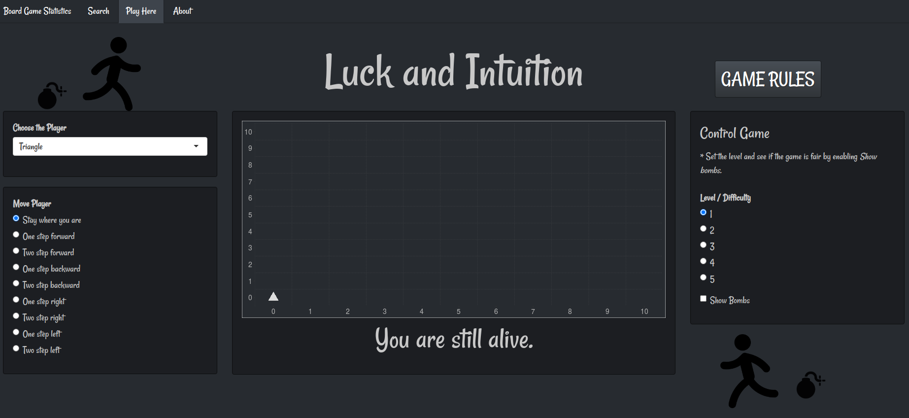

# Board Games Shiny app

The app was developed for the Data Science course in American University of Armenia as a bonus project.  

It intends to discover board games from all over the world including famous games as Chess, Bridge and so on.

The data was taken from [Kaggle website](https://www.kaggle.com/mrpantherson/board-game-data)
 Kaggle website. Then it was used to create graph to explore the games and served as a database for Search tab.

The third tab was the initial idea for the app: try create **A GAME WITH R**. Game Rules can be found in Play here tab.

[Link to the BOARD GAMES app.](https://lhds.shinyapps.io/board_games/) 

  

